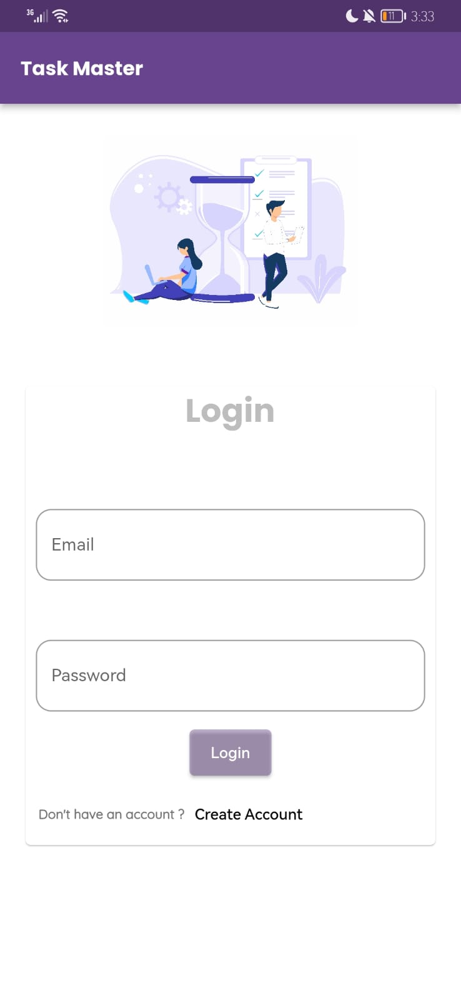
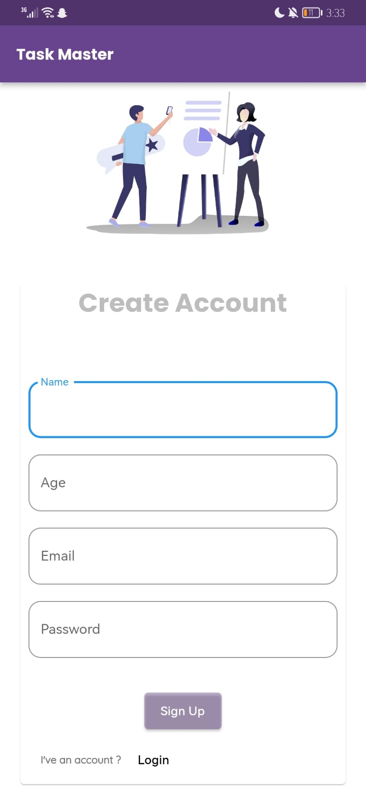
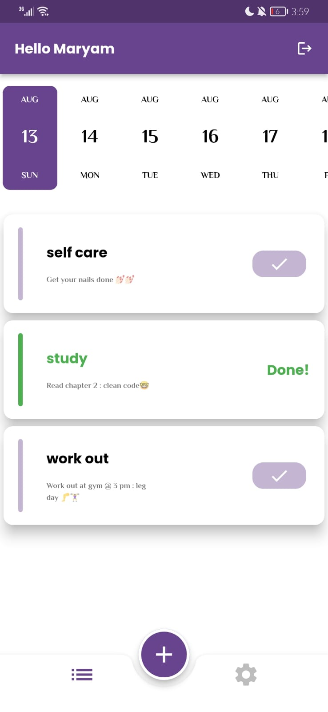
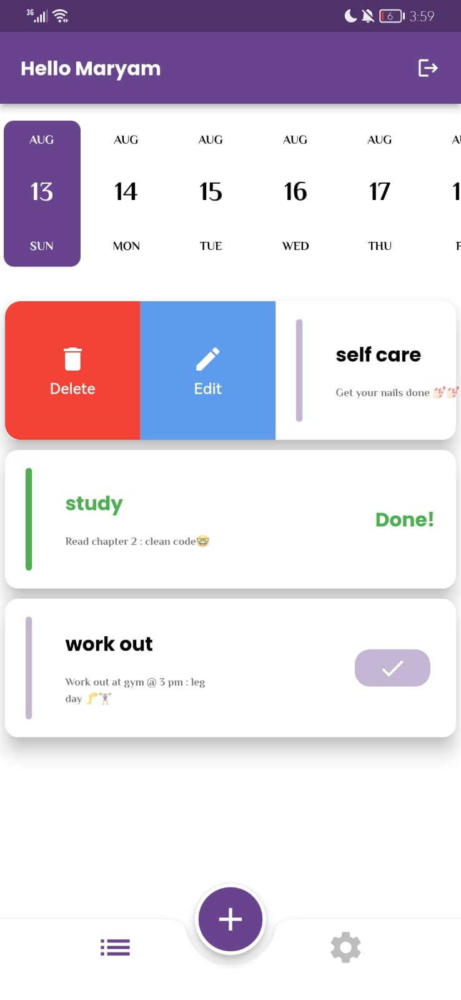
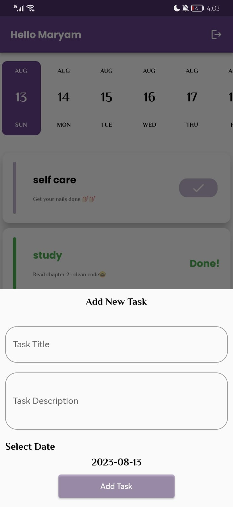
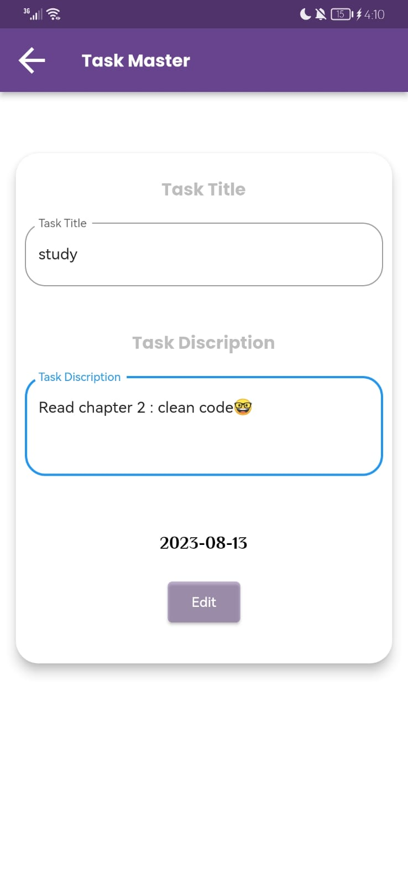

# 📋 Task Master - To Do Mobile Application

Welcome to the Task Master Flutter project repository! This mobile application is designed to help you manage your tasks and to-dos efficiently. With features such as Provider state management, Firebase Cloud Firestore integration, user authentication, and the MVVM architecture, Task Master aims to provide a seamless and organized task management experience

## 🌟 Features

- Create, edit, and delete tasks.
- Mark tasks as completed or pending.
- Seamless synchronization of tasks using Firebase Cloud Firestore.
- User authentication through Firebase, ensuring secure access to your tasks.
- Follows the MVVM (Model-View-ViewModel) architecture pattern for clean separation of concerns.
- Utilizes the Provider package for efficient and centralized state management.

---

Stay organized and efficient with Task Master! If you have any questions or feedback, please don't hesitate to reach out.

## 📸 Screenshots

Click to expand

### Login Screen

### signup Screen

### Home Screen

### Home Screen 2

### Add new Task

### Edit task Screen

